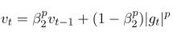

# Лабораторная работа 1	
## Цель работы:
Научиться реализовывать один из алгоритмов глубокого обучения с нуля.
## Задан
ие:
- Скачать датасет CarDatasets;	
- Реализовать сверточную нейронную сеть с использованием NumPy;
- Реализовать нейронную сеть с оптимизатором согласно варианту задания № 2 (ResNet50 + AdaMax). Архитектуру, указанную в варианте, необходимо реализовать с использованием Torch/Tensorflow/Jax;
- Оценить качество модели на тесте и сравните быстродействие реализованных вариантов;
- Запустить обучение на классическом Adam и сравнить сходимость результатов с вариантом задания;
- Сделать отчёт в виде readme на GitHub.

## Краткие теоретические сведения:
### Свертка:
Основным компонентом сверточной нейронной сети является свертка или как ее еще называют ядро (kernel).
В отличие от линейных слоев она позволяет эффективно обрабатывать пространственную информацию и работать с входным 
сигналом, представленным в виде матрицы, не разрушая пространственные связи. 
Визуализация сверточного слоя и его основные параметры свертки представлены на рисунке 1.
> Рисунок 1 - Сверточный слой

### ResNet:
До определенного момента сверточные нейронные сети сталкивались с проблемой затухания градиаента при попытке масштабирования 
архитектур. Решением этой проблемы стал "трюк" skip connection. А первой популярной архитектурой, использующей его стала 
ResNet с Residual Connection блоками. 
>Рисунок 2 - Residual Connection

> Рисунок 3 - Архитектура Resnet

### Adam & AdaMax: 
Adam — adaptive moment estimation, оптимизационный алгоритм. Он сочетает в себе и идею накопления момента и идею 
более слабого обновления весов для типичных признаков. 
Для накопления момента используются значения градиента
>

, а для оценки "нетипичности" признака используется средняя нецентрированная 
дисперсия.
> 

Начальная калибровка:
>

Итоговое правило обновления:
>

AdaMax отличается от Adam тем, что вместо дисперсии в качестве параметра отвечающего за "нетипичность"
рассчитывается инерционный момент распределения градиентов произвольной степени:
>

## Описание разработанной системы:
### CNN Numpy реализация:
В ходе выполнения работы с помощью библиотеки NumPy были реализованы следующие слои нейронной сети:
- Линейный слой;
- Сверточный слой;
- Функции активации Sigmoid и Softmax;
- Функция потерь Cross Entropy Loss;
- Reshape для преобразования карт признаков в одномерный вектор и подачи в линейный слой.

Код задания расположен в директории cnn_numpy_implementation/
Код проекта был протестирован на датасете MNIST.

>Значения функции потерь для 100 эпох обучения:
>

### ResNet PyTorch реализация:
В ходе выполнения работы была реализована архитектура ResNet50 с использованием фреймворка для глубокого обучения PyTorch.
Для обучения сети использовался набор данных "Stanford Cars Dataset".
Графики функции потерь и целевой метрики для оптимизатора Adam:

Графики функции потерь и целевой функции для оптимизатора AdaMax:

## Выводы:
В ходе выполнения работы были получены навыки самостоятельной реализации слоев нейронных сетей, реализации
существующих архитектур с использованием фреймворков для глубокого обучения. Из полученных результатов обучения на двух оптимизаторах
сложно судить о том, какой из них показал себя лучше для заданной архитектуры и набора данных.