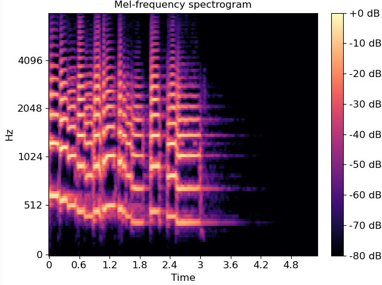
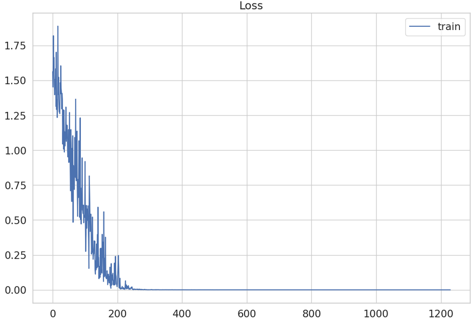
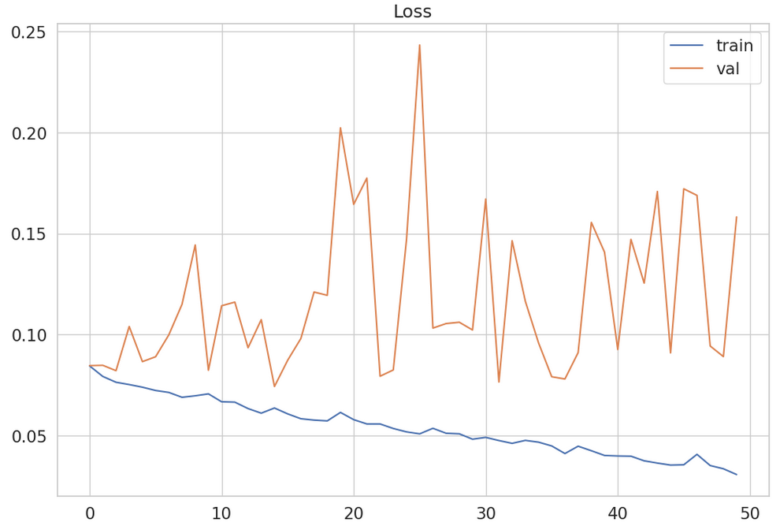
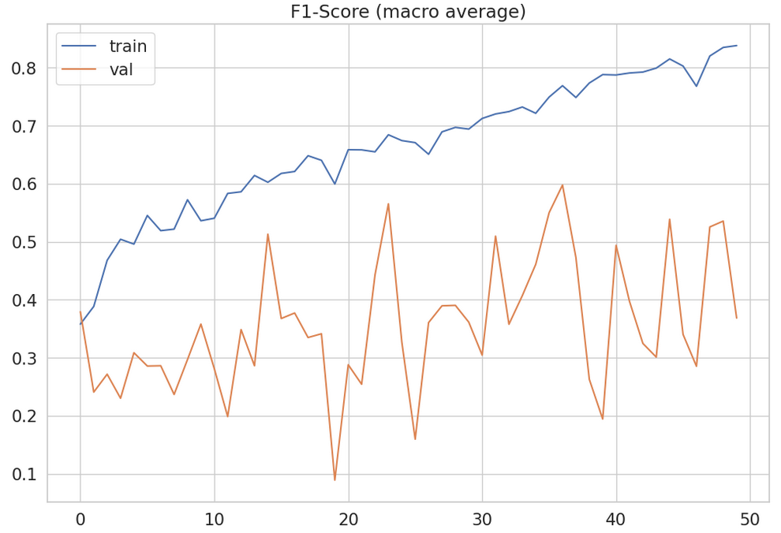

# Лабораторная работа № 2.
## Цель работы:
Научиться работать с предобученными моделями и на основе предобученных эмбеддингов строить новые модели.
## Задание:
- Скачать датасет "Youtube Videos Dataset"
- Отфильтровать датасет
- Получите эмбеддинги указанные в варианте и постройте нейронную сеть на основе них.
- Оцените качество модели на тесте.
- Сделайте отчёт в виде readme на GitHub, там же должен быть выложен исходный код.
## Краткие теоретические сведения:
## Мел-спектрограмма:
Аудио файлы представленные в виде цифрового сигнала не очень удобны для работы. 
Алгоритм построения мел-спектрограммы по набору частот:
- Разделяем вход на пересекающиеся фреймы;
- Применяем к каждому преобразование Фурье'
- Переводим полученную спектрограмму в мел-пространство.
>Рисунок 1 - Визуализация мел-спектрограммы
>

Мел-спектрограммы представляются в виде матриц и их формат удобен для подачи в CNN.
## Audio Spectrogram Transformer:
Audio Spectrogram Transformer - обобщение ViT трансформера для задачи обработки аудио. Архитектура AST трансформера представлена на 
рисунке 2.
>Рисунок 2 - архитектура AST

## Описание разработанной системы:
### Fine-tuning предобученной модели из библиотеки transformer:
В ходе выполнения работы было произведено дообучение предобученной модели AST на наборе данных
"Youtube Videos Dataset".

Лучшее значение метрики F1 на валидационной части датасета составило - 0.767.
### Реализации кастомной CNN для классификации аудио:

