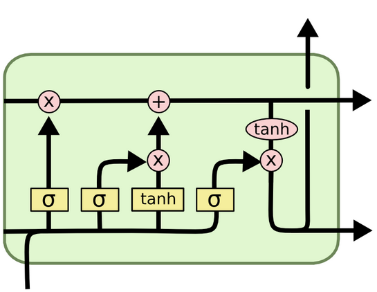
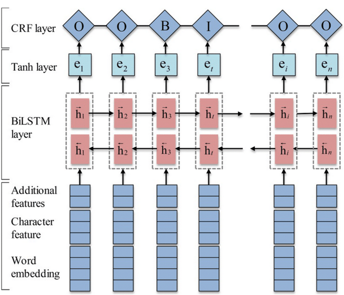
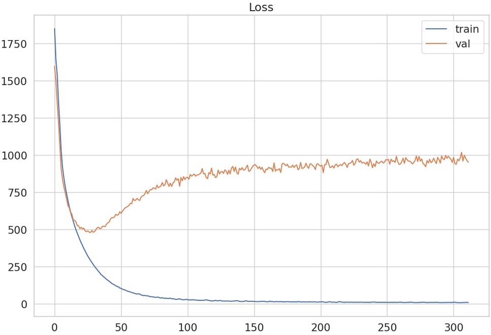
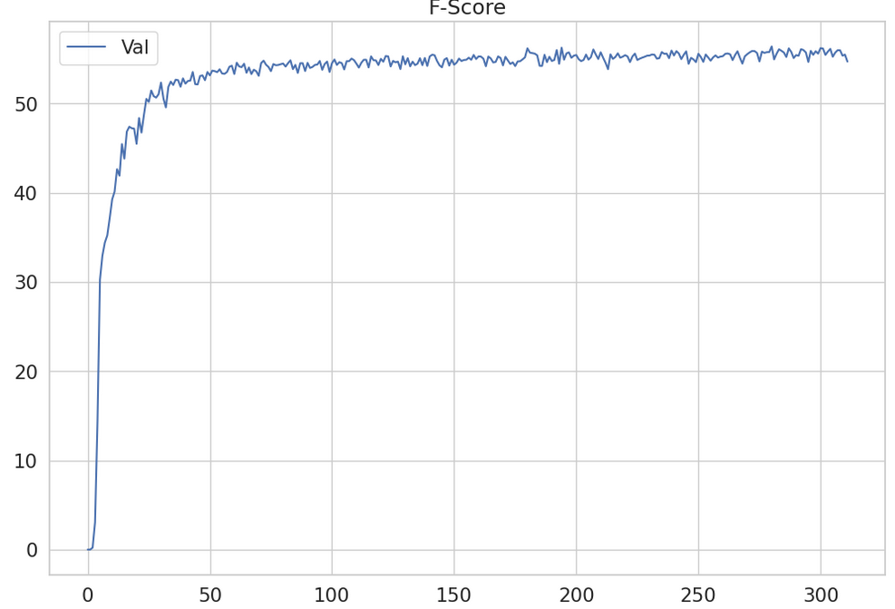

# Лабораторная работа № 3.

## Цель работы:

Цель работы: Научиться работать с типовыми задачами по обработке текста. Работа проектная.

## Задание:

Участие в соревновании https://github.com/dialogue-evaluation/RuREBus по NER.

- Скачать датасет Rurebus;
- Реализовать нейронную сеть, указанную в варианте №5 (BiLSTM-CRF) для задачи NER;
- Оценить качество модели на тесте;
- Сделать отчёт в виде readme на GitHub, там же должен быть выложен исходный код.

## Краткие теоретические сведения:

### NER:

NER - одна из задач области NLP, связанная с распознаванием именованных сущностей в корпусе текста.
Хотя большинство именованных сущностей состоит из нескольких слов, при решении этой задачи обычно рассматривают
отдельные
слова и решают, является ли это слово частью именованной сущности или нет. При этом различают начало, середину и конец
именованной сущности.
При разметке именованных сущностей принято использовать префикс «B» (beginning) для обозначения первого слова, «E» — для
последнего слова и «I» (intermediate) — для всех слов между. Иногда также используется префикс «S» (single) для
обозначения
именованной сущности, состоящей из одного слова.
Таким образом, задача сводится к пословной классификации.

### BiLSTM-CRF:

#### LSTM:

Рекуррентные нейронные сети хорошо работают в задач, в которых входной сигнал представлен в виде последовательности.
LSTM - рекуррентная нейронная сеть с LSTM ячейками:
> 

Архитектура BiLSTM-CRF представлена на рисунке 2.
> Рисунок 2 - Архитектура BiLSTM-CRF
>
> 

## Описание разработанной системы:

В ходе выполнения работы c помощью фреймворка PyTorch была разработана архитектура BiLSTM-CRF для задачи NER
Архитектура была обучена и провалидирована на наборе данных RuREBus.
Значения функции потерь и целевой метрики представлены на графиках ниже:

## Выводы:

Благодаря разработанной архитектуре удалось получить 56.21 значение метрики
F1-Score.
